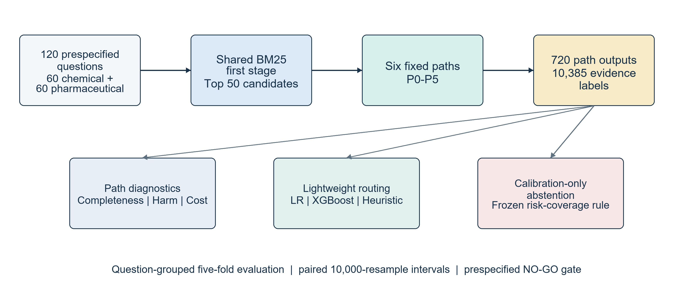
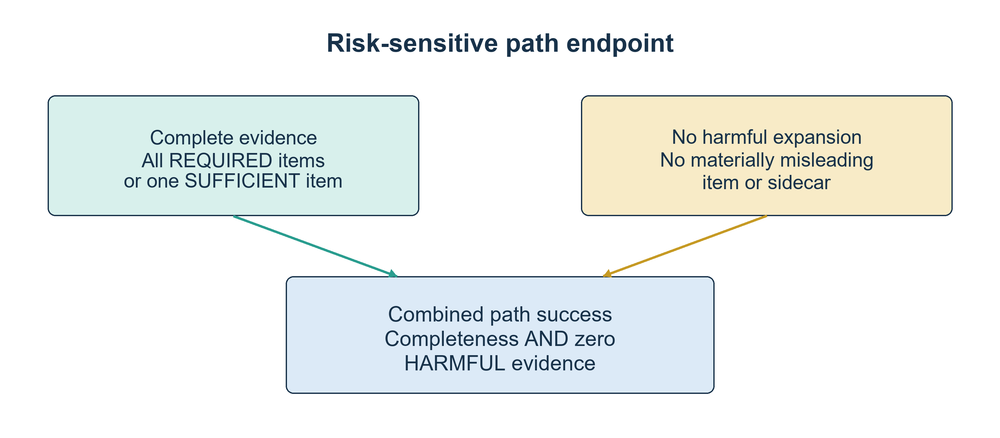
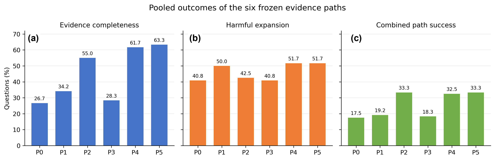
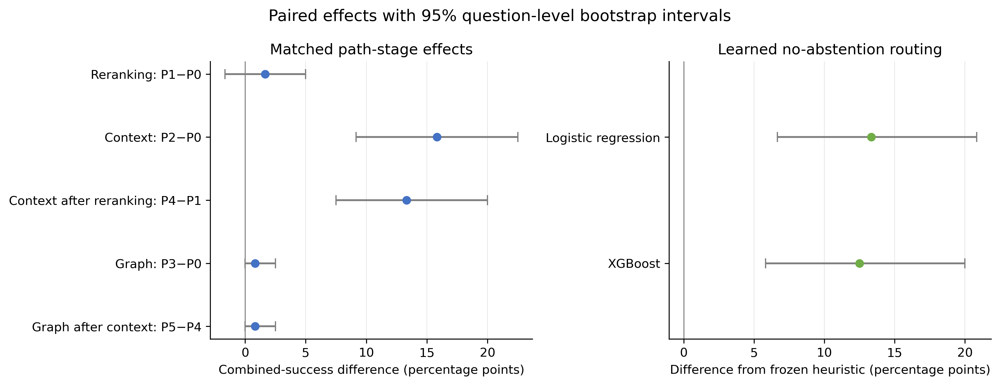

# When Does Evidence Expansion Help? A Cross-Domain Study of Retrieval Paths and Lightweight Routing for Regulatory Evidence

Kaifeng Sun
China Jiliang University, China

## Abstract

Regulatory question answering often fails because the decisive evidence is not
contained in the retrieved leaf passage but in its heading, parent clause,
table, or cited provision. We study whether common evidence-expansion stages
improve retrieval before generation under a risk-sensitive criterion that
requires complete supporting evidence and rejects materially misleading
additions. In a prespecified pilot of 120 questions drawn from Chinese
chemical-safety standards and English pharmaceutical-regulatory documents, we
compare six retrieval paths built on a shared BM25 first stage, including
reranking, structural-context expansion, relation expansion, and their
combinations. Human annotators labeled 10,385 evidence occurrences for
completeness and harmfulness. Structural context provided the clearest benefit:
adding heading, parent, and table context improved combined success by 15.83
percentage points over BM25, whereas reranking and one-hop relation expansion
yielded limited independent rescue. The most complete path did not outperform
the cheaper context-only path because additional evidence often introduced
harmful material. Lightweight learned routers outperformed a prespecified
heuristic in grouped out-of-fold evaluation, but calibration-based abstention
failed to achieve usable risk and coverage. These results support selective
use of structural context and separate evaluation of completeness and harm,
while indicating that reliable evidence-sufficiency abstention requires
substantially more calibration data.

**Keywords:** regulatory retrieval; risk-sensitive evaluation; structural
context expansion; selective routing; evidence sufficiency;
retrieval-augmented generation

## 1. Introduction

Regulatory questions often require more than a topically related passage. A
valid answer may depend on a heading that fixes the applicable scope, a parent
clause that identifies the responsible party, a table that supplies a numeric
threshold, or a cited provision that defines a term. Retrieval-augmented
systems provide external evidence and provenance for knowledge-intensive
tasks [1], but a fixed retrieval strategy cannot assume that every question
needs the same amount or type of expansion.

Modern pipelines commonly combine a lexical first stage with dense retrieval
or neural reranking [2-4]. Adaptive retrieval methods instead decide when to
retrieve or which reasoning strategy to use [5-7]. Hierarchical methods also
recover context at several levels of a document [8]. These approaches motivate
more flexible regulatory retrieval, but they do not remove a basic risk:
additional evidence can be irrelevant, conflicting, or deceptively close to
the correct rule. Prior work has shown that excessive or counterfactual
context can reduce downstream accuracy [9,10]. In a regulatory setting, a
passage about the wrong standard version, product, jurisdiction, threshold, or
exception can do more harm than ordinary topical noise.

This study asks when evidence expansion helps before generation. We separate
three outcomes: evidence completeness, harmful expansion, and combined path
success. A path succeeds only when it contains all required evidence (or a
single sufficient unit) and contains no evidence judged materially
misleading. This strict definition reflects a risk-averse retrieval setting.
It also exposes why reporting recall alone can overstate practical utility.

We constructed a frozen two-domain Pilot with 120 questions and ran six
predefined paths for every question. The paths isolate reranking, structural
context, and one-hop relation traversal while keeping BM25 as a common first
stage. We then evaluated two lightweight routers using only information
available after BM25 and a bounded metadata lookup. Document-grouped
out-of-fold evaluation, separate calibration folds, paired question-level
bootstrap intervals, and an explicit Go/No-Go rule limited post hoc
interpretation.

The study makes four contributions. First, it provides a risk-sensitive
evaluation of 720 regulatory question-path outputs with evidence-unit labels,
duplicate annotation, and adjudication. Second, it compares six paths while
separating completeness, harmful expansion, combined success, and execution
cost. Third, matched comparisons show that parent, heading, and table context
account for most independent rescue in this Pilot. Fourth, leakage-safe
evaluation shows that simple learned routing can outperform a frozen
cue-based heuristic, but calibrated abstention does not reach usable risk and
coverage. The last result caused the prespecified expansion decision to fail;
we report it as a boundary of the approach rather than tune it away.

**Figure 1. Prespecified study workflow from question construction to diagnostic
evaluation.**

## 2. Related Work

### 2.1 Sparse retrieval and neural reranking

BM25 remains a strong and interpretable lexical baseline derived from the
probabilistic relevance framework [11]. Dense Passage Retrieval demonstrated
that learned dual encoders can outperform lexical retrieval on several
open-domain question-answering benchmarks [2]. The BEIR benchmark later found
that BM25 remained robust across heterogeneous zero-shot tasks, while
reranking and late-interaction methods improved average effectiveness at
higher computational cost [4]. Sequence-to-sequence rerankers provide another
strong second stage over a bounded candidate set [3]. Our design follows this
multi-stage pattern but fixes BM25 as the first stage so that later path
differences remain attributable.

### 2.2 Adaptive and structured evidence retrieval

Active Retrieval Augmented Generation retrieves during long-form generation
when predicted content appears uncertain [5]. Self-RAG learns retrieval and
critique decisions through reflection tokens [6], and Adaptive-RAG selects
among no-retrieval, single-step, and multi-step strategies using predicted
question complexity [7]. RAPTOR organizes document evidence hierarchically to
retrieve at different levels of abstraction [8]. Our task differs in two
ways. It routes among fixed evidence-assembly paths before generation, and it
uses lightweight tabular models rather than training a language-model
controller. This narrower setting suits a small labeled Pilot and permits
explicit path-stage comparisons.

### 2.3 Evidence quality, noise, and abstention

RAG evaluation frameworks distinguish context relevance from answer
faithfulness and answer relevance [12,13]. We stop before answer generation
and label the retrieved package directly. This avoids using one language
model to judge another and allows annotators to identify evidence that changes
the regulatory interpretation. Studies of detrimental and counterfactual
contexts show why this distinction matters: more retrieved text can lower
answering performance, and relevant-looking conflict can mislead a model
[9,10]. Multilingual relevance assessment also shows that systems struggle
to recognize when supplied passages do not support an answer [14].

Confidence calibration asks whether a predicted probability matches empirical
correctness [15]. Selective prediction extends this problem by allowing a
model to reject decisions and evaluating the resulting risk-coverage trade-off
[16]. We use Brier score and expected calibration error for probability
quality, then test a prespecified calibration-only threshold for abstention.
The threshold is selected without access to the corresponding outer test fold.

### 2.4 Legal and regulatory language processing

Legal NLP benchmarks show strong domain effects and persistent
generalization challenges [17,18]. COLIEE evaluates case-law and statute-law
retrieval and entailment, and participating systems combine lexical retrieval,
transformers, structural information, filtering, and thresholds [19]. Our
corpora concern technical standards and pharmaceutical regulation rather than
case law. The same retrieval problem remains: a system must locate an
attributable provision under long, structured, and cross-referenced documents.

## 3. Study Design and Regulatory Corpora

### 3.1 Prespecified Pilot and research questions

The protocol, path definitions, model settings, evidence labels, grouped
splits, calibration rule, and continuation thresholds were frozen before path
labels were inspected. The original research question asked whether a
calibrated router could select the least costly successful path and abstain
when no path was likely to provide complete evidence. The final manuscript
retains all frozen decisions but centers the diagnostic questions supported by
the Pilot: how the paths differ, which stages rescue failures, whether simple
routers improve path selection, and where calibration and transfer fail.

The Pilot contains 120 newly written questions. Sixty Chinese questions cover
chemical-safety standards, and 60 English questions cover pharmaceutical
regulatory documents. Chemical questions were evenly divided among direct
clauses, parent or heading context, table-related evidence, citation
dependency, and evidence insufficiency (12 per category). The pharmaceutical
corpus contained no relation that resolved uniquely to an attributable target
chunk under the frozen graph rule. Its questions therefore comprised 15 each
for direct clauses, parent or heading context, tables, and evidence
insufficiency. Construction categories controlled coverage during authoring
but were never supplied to the routers.

Question authors inspected source evidence to express realistic information
needs but did not inspect P0-P5 rankings before freezing a question and its
evidence specification. A pre-freeze reviewer checked naturalness,
specificity, source validity, category fit, and overlap with two pre-existing
evaluation sets. All 120 questions were accepted after review. For
evidence-insufficient questions, a reviewer documented a manual search of the
frozen corpus; six failed paths alone could not establish corpus
insufficiency.

### 3.2 Chemical-safety corpus

The chemical corpus was a read-only Neo4j snapshot containing 9,206 standards,
991,453 sections, 68,422 tables, 743,055 hierarchy edges, and 33,818 logical
relation edges. The retrieval index used a CJK analyzer over section title,
summary, and content. A reproducible title screen produced 532 candidate
standards for human scope review; the final allowlist retained 399 standards
as question sources and excluded 133. Retrieved distractors could still come
from the wider frozen corpus. Globally unique section identifiers supported
evidence provenance, while standard identifiers defined grouping for
evaluation.

### 3.3 Pharmaceutical-regulatory corpus

The pharmaceutical snapshot contained 2,478 unique chunks drawn from 99
enriched files. Each record supplied a stable chunk identifier, document
identifier, heading, content, and parent context. A frozen graph snapshot
contained 7,578 nodes and 15,237 edges, including explicit document-level
references. None of these references resolved deterministically to one target
text chunk under the conservative protocol, so graph expansion returned no
eligible target in this domain. The study reports this structural absence
rather than introducing a heuristic target mapping after inspection.

**Table 1. Characteristics of the two regulatory retrieval domains.**

| Characteristic | Chemical-safety domain | Pharmaceutical-regulatory domain |
|---|---|---|
| Language | Chinese | English |
| Frozen source corpus | 9,206 standards and 991,453 sections | 99 enriched files and 2,478 unique chunks |
| First-stage retrieval | CJK BM25 index over section title, summary, and content | BM25 over stable document chunks |
| Structural context | Heading hierarchy, immediate parent, and tables | Heading, parent context, and tables |
| Eligible graph expansion | One-hop CITES or DEPENDS_ON targets when uniquely attributable | No reference resolved uniquely to an attributable target chunk |
| Pilot questions | 60 across five construction categories | 60 across four construction categories |

### 3.4 Annotation

Every ranked item and context sidecar received one label: REQUIRED,
SUFFICIENT, CONTEXT, IRRELEVANT, or HARMFUL. REQUIRED items collectively
formed a complete evidence specification; one SUFFICIENT item could satisfy a
single-item specification. CONTEXT clarified correct evidence without being
independently sufficient. IRRELEVANT covered background noise, duplication, or
weak topical overlap. HARMFUL identified evidence that could materially change
the regulatory interpretation, including the wrong standard version,
regulatory object, jurisdiction, responsibility, condition, threshold, or
exception, or evidence that directly conflicted with the correct rule.

Evidence completeness ignored harmful status and recorded whether the evidence
specification was met. Harmful expansion recorded whether any evaluated ranked
item or eligible sidecar was HARMFUL. Combined path success required complete
evidence and no harmful item. This is a deliberately strict, risk-averse
endpoint. Reporting all three outcomes shows whether a path failed because it
missed evidence or because it added misleading material.

**Figure 2. Risk-sensitive definition of combined path success.**

Primary annotation was blinded to path method names. The final freeze covered
10,385 evidence-label occurrences across 720 path outputs. A seeded,
category-stratified sample of 30 complete questions received independent
duplicate annotation across all six outputs and every associated evidence
unit. Across 901 visible duplicate rows, exact agreement was 71.48% (95%
question-cluster bootstrap interval, 66.11% to 76.85%), and Cohen's kappa was
0.556 (95% interval, 0.470 to 0.637) [20]. The adjudication queue contained
279 disagreements or harmful-reason differences, corresponding to 837 final
path-level occurrences. Both original labels and the adjudication record were
preserved.

## 4. Evidence Paths and Lightweight Routing

### 4.1 Six frozen paths

BM25 ran once to depth 50, and ranked evaluation was truncated at 10. P0
returned BM25 top 10. P1 reranked the BM25 top 50 with
Qwen3-Reranker-0.6B and returned the top 10. P2 added structural context to
the first five BM25 seeds. P3 expanded one outgoing CITES or DEPENDS_ON
relation from the first five BM25 seeds. P4 combined reranking and context.
P5 combined reranking, context, and relation expansion.

Context sidecars were ordered as heading path, immediate parent, and table,
with at most three sidecars per seed. Sidecars retained separate identifiers
and did not consume ranked positions. Relation expansion preserved the five
seeds, inserted at most five unique targets, followed one outgoing normalized
relation at confidence at least 0.85, and used deterministic tie-breaking.
This bounded construction prevents a general graph walk from entering the
study.

The reranker used normalized yes-versus-no relevance probability, a maximum
length of 1,024 tokens, bfloat16 inference, and deterministic ordering by
reranker score, BM25 rank, and source identifier. The model snapshot was
identified by a frozen file-manifest hash. No reranker training or
hyperparameter search was performed.

### 4.2 Fixed policies and Oracle

We compared BM25-only (P0), all modules (P5), a frozen heuristic, two learned
routers, and a diagnostic Oracle. The heuristic selected P2 for table or
context cues, P3 for citation cues, P5 when both cue types appeared, P1 when
the BM25 ambiguity gap was below 0.15, and P0 otherwise. The Oracle selected
the lowest-cost successful path for each routable question. When no path
succeeded, it abstained and received zero combined success. Such questions
remained in all-question quality results but were excluded from routable-only
Oracle cost comparisons.

Cost was a lexicographic tuple of neural calls, graph targets, context items,
median runtime, and path identifier. This definition makes the Oracle a
diagnostic upper bound over the evaluated paths, not a deployable system.

### 4.3 Router features and models

Each question-path pair formed one supervised record. The label was combined
path success. Features were available immediately after BM25 plus a bounded
metadata-only lookup: domain, normalized query length, top BM25 score, score
gaps from rank 1 to ranks 2 and 5, entropy of the top-10 BM25 scores, table and
citation cue indicators, eligible outgoing-edge count, maximum stored edge
confidence, path identifier, and frozen path-cost attributes. Router features
excluded construction category, evidence labels, reranker outputs, fetched
graph targets, retrieved text overlap, and any post-execution measurement.

The learned models were L2 Logistic Regression with C = 1 and XGBoost with 100
depth-3 trees, learning rate 0.05, subsample 0.8, column subsample 0.8, and L2
regularization 1 [21]. We conducted no model or hyperparameter search.

### 4.4 Splits, calibration, and abstention

Questions sharing a source document, standard, clause family, table, or
relation family shared one group identifier. A stable seeded hash assigned
groups to five folds. For outer fold i, fold i was the test set, fold
(i + 1) mod 5 was the calibration set, and the remaining three folds trained
the model. The feature vectorizer and scaler were fit on training records
only.

Logistic Regression used its native probabilities. XGBoost probabilities
received Platt calibration on the calibration fold. The abstention threshold
was the smallest distinct calibrated probability on that fold for which at
least 10 question decisions were accepted and empirical accepted failure was
at most 10%. If no threshold qualified, the fold forced full abstention. The
threshold then remained unchanged on the outer test fold. The no-abstention
variant selected the lowest-cost path above the same threshold; when no path
qualified, it selected the maximum-probability path.

### 4.5 Statistical analysis

Path rates used all 120 questions or the stated 60-question domain subset.
Matched path and policy differences used 10,000 paired bootstrap resamples at
the complete-question level with seed 20260723. We report percentile 95%
intervals. Exact McNemar tests assessed paired discordant outcomes [22], and
Holm correction controlled family-wise error across the five stage
comparisons [23]. Router comparisons against the heuristic used the same
paired question-level procedure. Probability quality used Brier score and a
fixed 10-bin expected calibration error. Selective results report coverage,
accepted failure, and abstention separately.

Cross-domain transfer trained and calibrated on one complete source domain and
evaluated the untouched target domain. Because chemical questions were Chinese
and pharmaceutical questions were English, domain and language shift were
confounded. We therefore treat transfer as descriptive.

## 5. Results

### 5.1 Path outcomes

Table 2 reports pooled outcomes. BM25-only reached 26.67% completeness and
17.50% combined success. Adding context without a neural call (P2) raised
completeness to 55.00% and combined success to 33.33%. The full P5 path reached
the highest completeness, 63.33%, but also produced harmful evidence on
51.67% of questions. Its combined success remained 33.33%, equal to P2. More
complete retrieval did not produce a better risk-sensitive endpoint.

**Table 2. Pooled outcomes for the six prespecified evidence paths (n = 120).**

| Path | Evidence completeness (%) | Harmful expansion (%) | Combined success (%) | Mean neural calls |
|---|---:|---:|---:|---:|
| P0 | 26.67 | 40.83 | 17.50 | 0.00 |
| P1 | 34.17 | 50.00 | 19.17 | 1.00 |
| P2 | 55.00 | 42.50 | 33.33 | 0.00 |
| P3 | 28.33 | 40.83 | 18.33 | 0.00 |
| P4 | 61.67 | 51.67 | 32.50 | 1.00 |
| P5 | 63.33 | 51.67 | 33.33 | 1.00 |

Domain results differed. In chemical safety, P2 and P5 each reached 21.67%
combined success, compared with 16.67% for P0. Harmful expansion reached
66.67% for reranked paths P1, P4, and P5. In pharmaceutical regulation, P2,
P4, and P5 each reached 45.00% combined success, compared with 18.33% for P0.
The pharmaceutical graph stage inserted no eligible target, so P3 matched P0
and P5 matched P4 except for negligible execution overhead.

**Figure 3. Pooled evidence completeness, harmful expansion, and combined
success across P0-P5. (a) Evidence completeness; (b) harmful expansion; and
(c) combined path success.**

### 5.2 Matched stage effects

Matched comparisons identified context as the only stage with a substantial
and repeatable effect (Table 3). P2 improved combined success over P0 by 15.83
percentage points (95% paired bootstrap interval, 9.17 to 22.50; exact
McNemar p = 0.0000038; Holm-adjusted p = 0.000019). P4 improved over P1 by
13.33 points (95% interval, 7.50 to 20.00; Holm-adjusted p = 0.000122).
Neither context comparison lost a previously successful question.

Reranking improved combined success by 1.67 points (95% interval, -1.67 to
5.00), rescuing three questions and losing one. Each graph comparison improved
success by 0.83 points (95% interval, 0 to 2.50) and rescued one question.
Under the prespecified rescue definition, context rescued 19 unique
questions, reranking three, and graph traversal one.

**Table 3. Matched path-stage effects on combined success.**

| Added stage | Comparison | Difference (pp) | 95% CI (pp) | Rescued | Lost | Holm-adjusted p |
|---|---|---:|---:|---:|---:|---:|
| Context | P2 - P0 | 15.83 | 9.17 to 22.50 | 19 | 0 | <0.001 |
| Context after reranking | P4 - P1 | 13.33 | 7.50 to 20.00 | 16 | 0 | <0.001 |
| Reranking | P1 - P0 | 1.67 | -1.67 to 5.00 | 3 | 1 | 1.000 |
| Graph | P3 - P0 | 0.83 | 0.00 to 2.50 | 1 | 0 | 1.000 |
| Graph after reranking/context | P5 - P4 | 0.83 | 0.00 to 2.50 | 1 | 0 | 1.000 |

Construction diagnostics explain part of the context effect. Among 15
pharmaceutical parent or heading questions, P2 rescued 11 relative to P0 and
P4 rescued 10 relative to P1. Each context comparison rescued five of 15
pharmaceutical table questions. Chemical context gains were smaller: P2
rescued two of 12 table questions and one of 12 parent or heading questions.
The single graph rescue occurred among chemical citation-dependency
questions. These categories were authored to represent distinct evidence
structures, so the concentration supports mechanism interpretation but limits
claims of uniform domain-independent benefit.

**Figure 4. Paired effects of added path stages and learned routers. Error bars
show 95% paired question-level bootstrap intervals.**

### 5.3 Lightweight routing

The frozen heuristic achieved 19.17% combined success. Logistic Regression
reached 32.50%, a gain of 13.33 points (95% interval, 6.67 to 20.83;
Holm-adjusted exact McNemar p = 0.0017). XGBoost reached 31.67%, a gain of
12.50 points (95% interval, 5.83 to 20.00; adjusted p = 0.0017). Both
improvements had the favorable direction in four of five outer folds.

Logistic Regression used 0.533 mean neural calls per question, slightly more
than the heuristic's 0.500. XGBoost used 0.392, a 21.7% reduction. The
all-modules policy achieved 33.33% success with one neural call, while the
Oracle achieved 36.67% over all questions. Only 44 questions had any
successful path. Among these routable questions, the Oracle used 0.068 mean
neural calls because the lexicographic cost rule favored successful
non-neural paths.

**Table 4. Fixed and learned policy outcomes.**

| Policy | Combined success (%) | Mean neural calls | Selective coverage (%) | Accepted failure (%) |
|---|---:|---:|---:|---:|
| BM25-only | 17.50 | 0.000 | 100.00 | Not applicable |
| All modules | 33.33 | 1.000 | 100.00 | Not applicable |
| Frozen heuristic | 19.17 | 0.500 | 100.00 | Not applicable |
| Logistic Regression | 32.50 | 0.533 | 9.17 | 63.64 |
| XGBoost | 31.67 | 0.392 | 0.00 | Not defined |
| Oracle (diagnostic) | 36.67 | 0.068* | 36.67 | 0.00 |

*Oracle neural calls are calculated over the 44 routable questions only.

### 5.4 Calibration and abstention

The Logistic Regression no-abstention predictions had a Brier score of 0.200
and a 10-bin expected calibration error of 0.098. XGBoost produced 0.289 and
0.264. These global scores did not yield a useful selective policy. Logistic
Regression accepted 11 of 120 outer-test decisions, for 9.17% coverage, and
seven accepted decisions failed, for 63.64% accepted failure. Four of five
folds forced full abstention because their calibration partitions contained no
threshold meeting the frozen risk and minimum-count constraints. XGBoost
forced full abstention in all five folds.

The protocol required at least 20% coverage, accepted failure at most 10%, and
a failure reduction of at least five points relative to no-abstention routing.
Neither model met these conditions. We did not scan outer-test predictions,
lower the minimum accepted count, or relax the risk threshold.

### 5.5 Descriptive transfer

Training on chemical questions and testing on pharmaceutical questions yielded
45.00% no-abstention success for Logistic Regression and 30.00% for XGBoost.
The reverse direction yielded 21.67% and 23.33%. All four source-domain
calibration procedures forced full abstention on the target domain. Since
domain and language changed together, these values cannot isolate either
factor. They provide no evidence that evidence-sufficiency calibration
transfers.

### 5.6 Prespecified continuation decision

The prespecified continuation rule was not satisfied. Two of five quantitative
signals passed: Oracle routing met the practical improvement criterion, and
both learned no-abstention routers beat the heuristic. The path-heterogeneity,
independent-module-rescue, and calibrated-abstention signals failed, as did one
qualitative gate. The resulting decision was NO-GO for expansion of the
original calibrated-routing study. Appendix A reports the fixed decision
criteria and their outcomes.

## 6. Discussion

### 6.1 Context expansion supplied most of the useful evidence

Adding heading, parent, and table sidecars to BM25 nearly doubled pooled
combined success, from 17.50% to 33.33%,
without a neural call. The gain came mainly from questions whose answer scope
was structurally separated from the retrieved leaf text. This pattern aligns
with hierarchical retrieval research [8], but the present result concerns
attributable source context rather than generated summaries.

Pharmaceutical parent and table questions benefited much more than their
chemical counterparts. Differences
in document preparation, chunking, and table representation may explain part
of this gap. A larger study should stratify results by naturally occurring
document structures rather than fixed authoring quotas and should test whether
the same mechanism persists under independently sampled user questions.

### 6.2 More modules did not produce a better risk-sensitive path

P5 retrieved the most complete evidence but did not improve combined success
over P2. Reranking raised completeness while also raising the rate of harmful
evidence, especially in the chemical domain. These findings resemble prior
reports that detrimental or conflicting context can reduce downstream
performance [9,10]. Our endpoint is stricter because one harmful unit causes
path failure. The strict rule suits high-risk evidence delivery, but readers
should examine completeness and harm separately when applying the findings to
lower-risk tasks.

Graph traversal had little opportunity to help. The chemical corpus produced
one independent graph rescue, and the pharmaceutical corpus produced no
eligible target under the frozen attribution rule. These data cannot establish
that regulatory relations lack value. They show that conservative, one-hop,
uniquely attributable relations were sparse in these snapshots. A future
graph study would need better relation coverage and independent evidence
specifications, not a more permissive traversal added after seeing the Pilot.

### 6.3 Lightweight routing learned useful path preferences

Both learned routers recovered most of the all-modules success while selecting
paths per query. XGBoost also reduced neural calls relative to the heuristic.
The gain over a fixed cue policy suggests that BM25 score shape, query length,
domain, bounded relation metadata, and path identity contain predictive
signal. The Oracle gap was modest in absolute success, but only 44 questions
were routable, which limits the amount of positive supervision.

Simple models were adequate for this small route-selection study. The
experiment does not establish a generally deployable router. The same question structures
that created path differences also shaped the training distribution, and
domain was an explicit feature. The transfer results cannot separate domain
from language. An external test with naturally sampled questions would be
needed before deployment.

### 6.4 Abstention failed despite acceptable-looking global calibration metrics

Selective prediction failed despite favorable global metrics for Logistic
Regression. Its Brier score and ECE appeared better than XGBoost's, yet its 11
accepted decisions failed 63.64% of the time. XGBoost found no valid operating
threshold. Average calibration summaries therefore did not guarantee a safe
low-risk acceptance region.

Small calibration folds, few successful question-path pairs, dependence among
the six paths for each question, and cross-domain heterogeneity all reduce
threshold stability. The protocol's minimum of 10 accepted calibration
questions prevented a threshold from being justified by a handful of easy
cases. That safeguard produced degenerate coverage, which is preferable to
reporting a threshold selected on test outcomes. A future abstention study
would require a larger calibration population and an independently frozen test
set.

### 6.5 Limitations

The Pilot is small and deliberately balanced by evidence structure. Its rates
do not estimate the natural frequency of direct, contextual, tabular,
relational, or unanswerable regulatory questions. Chemical and pharmaceutical
data also differ in language, corpus size, document structure, retrieval
implementation, and relation availability. Cross-domain comparisons remain
descriptive.

Annotation agreement was moderate. The HARMFUL category requires judgment
about whether evidence can change a regulatory interpretation. Ordered rules,
complete-question duplicate annotation, retained raw decisions, and
adjudication improve transparency, but they do not eliminate subjectivity.
The strict combined-success rule may understate performance for applications
that can safely ignore irrelevant or conflicting items.

The study evaluates evidence retrieval, not generated answers. It cannot show
that a language model would use complete evidence faithfully or that an end
user would interpret the package correctly. Runtime values came from two
different local source systems and should not be treated as a hardware-neutral
benchmark. The Oracle only selects among six evaluated paths and does not
bound the performance of other retrieval strategies.

## 7. Conclusion

Evidence expansion was most useful when decisive scope information was
structurally adjacent to the retrieved passage rather than lexically distant
from it. Across both regulatory domains, adding heading, parent, and table
context produced the clearest independent gain and matched the full path's
risk-sensitive success without a neural call. Reranking and conservative graph
traversal yielded little independent rescue, while indiscriminate expansion
often added harmful evidence. The practical implication is narrow but clear:
structural context should be added selectively, and retrieval quality should
report completeness and harm separately rather than treating more evidence as
automatically better.

Lightweight learned routers outperformed the prespecified heuristic under
grouped out-of-fold evaluation, but the present sample did not support a
reliable abstention policy. This is a data-limited negative finding rather than
evidence that evidence-sufficiency abstention is impossible. Larger independent
calibration sets, naturally sampled questions, and less confounded
cross-domain evaluation are required before the routing and abstention
components can support deployment.

## Author Contributions

Kaifeng Sun is the sole author and was responsible for conceptualization,
methodology, software, validation, formal analysis, investigation, data
curation, visualization, writing the original draft, reviewing and editing the
manuscript, and project administration.

## Data and Code Availability

The public repository contains the frozen protocol, schemas, code, aggregate
manifests, tables, figures, and hashes needed to reproduce the reported
statistics. Copyrighted source corpora, database snapshots, source passages,
credentials, question-level predictions, and completed annotation workbooks
are excluded. The repository is available at
https://github.com/Kaifengsun/calibrated-regulatory-evidence-routing.

## Ethics Statement

The study used regulatory documents and technical standards and did not collect
personal or sensitive information. Annotation was performed to construct and
evaluate the retrieval dataset; annotators were not treated as research
participants. The system is a research prototype and should not replace
professional regulatory interpretation. A retrieved evidence package can
remain incomplete or misleading even when a path receives a high predicted
score.

## Appendix A. Continuation Criteria and HARMFUL Evidence Examples

### A.1 Prespecified continuation decision

The study could continue only if all three qualitative gates and at least four
of five quantitative signals passed. Two quantitative signals passed. Oracle
routing met the practical improvement criterion, and both learned
no-abstention routers beat the heuristic. Three signals failed: 23 questions
(19.17%) needed a successful path beyond P0, just below the required 24
questions (20%); only context met the minimum five-question module-rescue
threshold, whereas two module types were required; and calibrated abstention
did not achieve the prespecified risk and coverage. One qualitative gate also
failed conservatively because the strongest context gains were concentrated in
authoring strata designed to need parent or table context. No threshold,
question, path, or model was changed after this decision.

### A.2 Illustrative HARMFUL evidence categories

The examples below are schematic paraphrases of the annotation rules rather
than quotations from the source corpora.

| Category | Illustrative case | Why it is HARMFUL rather than IRRELEVANT |
|---|---|---|
| Wrong version | A superseded standard is retrieved for a requirement governed by the current edition. | The obsolete rule can change the applicable obligation. |
| Wrong regulatory object | A provision for a different product, substance, or responsible party appears topically relevant. | The evidence can transfer a duty or restriction to the wrong object. |
| Wrong condition or threshold | A nearby clause supplies a different concentration, duration, or triggering condition. | The value can directly alter the regulatory decision. |
| Conflicting exception | An exception from another scope is added without the clause that limits its use. | The package can incorrectly imply that the main requirement does not apply. |

## References

See `manuscript/references.md`.
